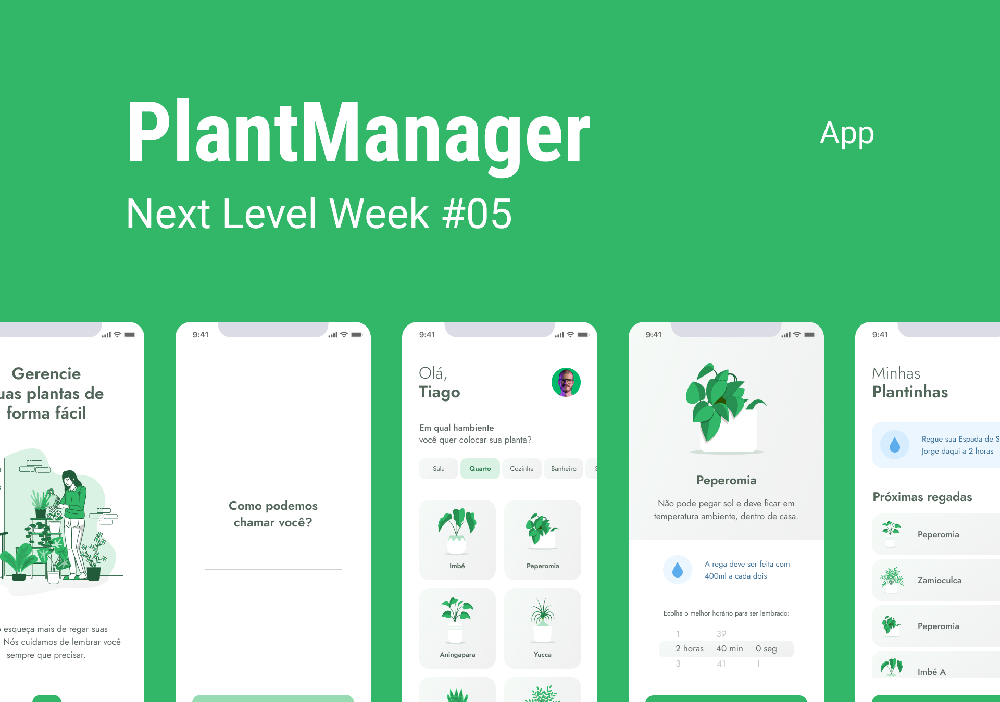

<p align="center">
  
</p>

<p align="center">
  🌱 Aplicação mobile desenvolvida para controle de rega e acompanhamento de plantas
</p>

---



### :art: [Acesse o protótipo do projeto no Figma](https://www.figma.com/file/4sZgtjatnIDk1nm9RPjKje/PlantManager-Copy?node-id=2%3A3)

## :hammer_and_wrench: Tecnologias

- [React Native](https://reactnative.dev/)
- [Expo](https://expo.io/)
- [Lottie](https://lottiefiles.com/)
- [TypeScript](https://www.typescriptlang.org/)

## :gear: Como rodar a aplicação

👉 **É necessario ter o [NodeJS](https://nodejs.org/en/) instalado para rodar o projeto**

```bash
# Clone este repositório
$ git clone <https://github.com/gaoliveira21/plantmanager.git>

# Acesse a pasta do projeto no terminal/cmd
$ cd plantmanager

# Instale as dependências
$ npm install # ou rode yarn se preferir

# Inicie o projeto
$ npm start # ou se preferir yarn start

```

### :construction_worker: Feito por:

<table>
  <tr>
    <td align="center"><a href="https://github.com/gaoliveira21"><br /><sub><b>Gabriel Oliveira</b></sub></a><br /></td>
  </tr>
</table>

**Contato:** <a href="https://www.linkedin.com/in/gabriel-jos%C3%A9-de-oliveira-633962197/">Linkedin</a>

